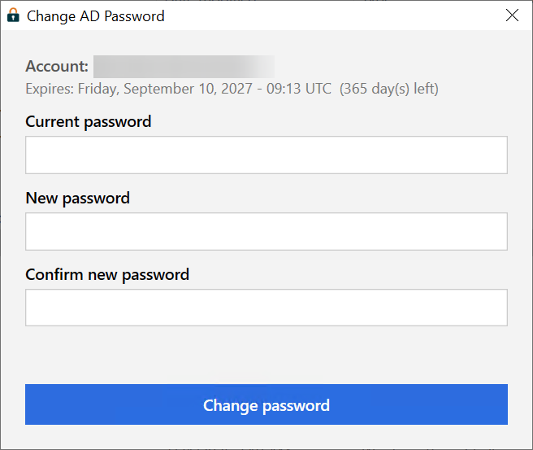

# AD Password Changer

Small PowerShell utility (WPF interface) to change your Active Directory password without using the `Ctrl+Alt+Del` (`Ctrl+Alt+End` in an RDP session, since the host OS intercepts `Ctrl+Alt+Del` locally) combination, useful when pasting text is disabled in an RDP session.

<p align="center">
  
</p>

## What this is (and isn't)

This is a **self-service password change** tool for the user who is currently logged in - not an admin password reset tool.

- You must be logged into an active Windows session on a domain-joined machine, with network connectivity to a domain controller.
- You must know your **current** password. The tool asks for it and uses it to change the password (`UserPrincipal.ChangePassword`), exactly like the native Windows "change password" flow - it never bypasses or resets it.
- There is no admin mode, no way to target another account and no way to reset a forgotten/expired password without knowing the current one. If you've forgotten your password, this tool cannot help - that requires an admin-driven reset instead.

## Download

Grab `ADPasswordChanger.exe` from the [latest release](../../releases/latest) and run it directly - no install, no PowerShell execution policy to fight with.

## How it works

The form (current password, new password, confirmation) is filled in by typing. The target account is always the current Windows session's account (`UserPrincipal.Current`): there is no username field, so it is not possible to change another account's password. Before calling `ChangePassword`, the tool also compares the resolved AD account's SID with the Windows session's own SID (`WindowsIdentity.GetCurrent()`) and aborts without modifying anything if they ever differ. The password change itself is performed via `UserPrincipal.ChangePassword`, which requires no special privileges: only the user's current password is needed, just like a regular password change.

The machine must be joined to the relevant Active Directory domain. The form also shows when the current password expires (via the `msDS-UserPasswordExpiryTimeComputed` attribute), if that information is available.

**Not compatible with Entra ID-joined-only devices** (no on-premises AD, so no LDAP to talk to). On startup the tool checks `dsregcmd /status`: if the device is not domain-joined, the form fields and button are disabled and a message explains why, instead of letting the password change fail.

All error messages are forced to English (`en-US` thread culture) regardless of the Windows display language.

## Building from source

The exe is a plain PowerShell script (`ADPasswordChanger.ps1`) compiled with [ps2exe](https://github.com/MScholtes/PS2EXE) - useful if you want to read or modify the code before trusting it.

```powershell
.\ADPasswordChanger.ps1        # run directly, no build needed
.\build\build.ps1              # or compile it into dist\ADPasswordChanger.exe
```

`build.ps1` installs ps2exe automatically if missing and uses `build\icon.ico` (regenerated with `build\generate-icon.ps1`).

## Warning

This tool handles passwords. Fields are never logged or written to disk - they only travel through the `ChangePassword` call to the domain controller.

The password never travels in clear text over the network. `PrincipalContext('Domain')` is created without explicit credentials or options, so .NET defaults to `ContextOptions.Negotiate | ContextOptions.Signing | ContextOptions.Sealing`: the LDAP session is authenticated with the current user's Kerberos ticket and sealed (encrypted at the SASL layer), not a plain-text simple bind. This is on the standard LDAP port (389), not LDAPS (636), but the Kerberos sealing already makes the channel confidential - and a domain controller refuses password-change operations over an unsealed LDAP connection in the first place, so an unencrypted attempt would simply fail rather than succeed in clear text.
